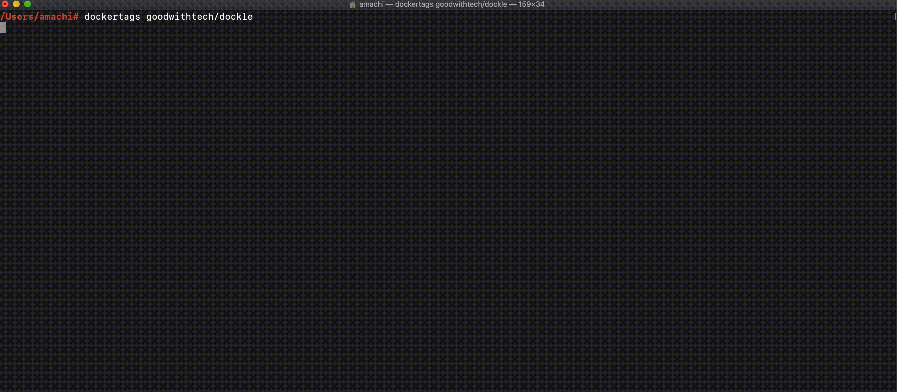

# dockertags
Show information of container images ordered by recently updated. <br />
Now supporting Docker Hub, GCR (Google Container Registry) and Amazon ECR (Elastic Container Registry).




## Quick Start

```bash
$ brew install goodwithtech/r/dockertags
$ dockertags [IMAGE_NAME]

or 

$ docker run --rm goodwithtech/dockertags [IMAGENAME]
```
## When to Use

Make easy to fetch target tag in scheduled operation.
 
```.env
$ dockertags -limit 1 -format json <imagename> | jq -r .[0].tags[0]
...output tag...

# Scan a latest container image with https://github.com/aquasecurity/trivy
$ export IMAGENAME=<imagename>
$ trivy $IMAGENAME:$(dockertags -limit 1 -format json $IMAGENAME | jq -r .[0].tags[0])
```

## Examples

```bash
$ dockertags goodwithtech/dockle
+---------+-------+----------------------+-------------+
|   TAG   | SIZE  |      CREATED AT      | UPLOADED AT |
+---------+-------+----------------------+-------------+
| latest  | 21.1M | 2019-12-16T14:05:18Z | NULL        |
| v0.2.4  | 21.1M | 2019-12-05T05:18:04Z | NULL        |
| v0.2.3  | 21.1M | 2019-11-17T15:03:10Z | NULL        |
| v0.2.2  | 21.1M | 2019-11-17T14:45:53Z | NULL        |
...... 
| v0.0.18 | 20.4M | 2019-06-10T18:31:45Z | NULL        |
+---------+-------+----------------------+-------------+

# You can set limit, filter and format
$ dockertags -limit 2 -contain v0.2 -format json goodwithtech/dockle
[
  {
    "tags": [
      "v0.2.4"
    ],
    "byte": 22154435,
    "created_at": "2019-12-05T05:18:04.174078Z",
    "uploaded_at": null
  },
  {
    "tags": [
      "v0.2.3"
    ],
    "byte": 22154435,
    "created_at": "2019-11-17T15:03:10.914092Z",
    "uploaded_at": null
  }
]
```

## GitHub Actions

You can scan target image everyday recently updated.<br />
This actions also notify results if trivy detects vulnerabilities.

```
name: Scan the target image with trivy
on:
  schedule:
      - cron:  '0 0 * * *'
jobs:
  scan:
    name: Scan via trivy
    runs-on: ubuntu-latest
    env:
      IMAGE: goodwithtech/dockle # target image name
      FILTER: v0.2    # pattern : /*v0.2*/
    steps:
      - name: detect a target image tag
        id: target
        run: echo ::set-output name=ver::$(
            docker run --rm goodwithtech/dockertags -contain $FILTER -limit 1 -format json $IMAGE
            | jq -r .[0].tags[0]
            )
      - name: detect a trivy image tag
        id: trivy
        run: echo ::set-output name=ver::$(
            docker run --rm goodwithtech/dockertags -limit 1 -format json aquasec/trivy
            | jq -r .[0].tags[0]
            )
      - name: check tags
        run: |
          echo trivy ${{ steps.trivy.outputs.ver }}
          echo $IMAGE ${{ steps.target.outputs.ver }}
      - name: scan the image with trivy
        run: docker run aquasec/trivy:${{ steps.trivy.outputs.ver }}
          --cache-dir /var/lib/trivy --exit-code 1 --no-progress
          $IMAGE:${{ steps.target.outputs.ver }}
      - name: notify to slack
        if: failure()
        uses: rtCamp/action-slack-notify@master
        env:
          SLACK_CHANNEL: channel  # target channel
          SLACK_MESSAGE: 'failed : trivy detects vulnerabilities'
          SLACK_TITLE: trivy-scan-notifier
          SLACK_WEBHOOK: ${{ secrets.SLACK_WEBHOOK }}
```

## Authentication

### Docker Hub

You can use `--username` and `--password` of Docker Hub.

```bash
dockertags -u goodwithtech -p xxxx goodwithtech/privateimage
```

### Amazon ECR (Elastic Container Registry)

Use [AWS CLI's ENVIRONMENT variables](https://docs.aws.amazon.com/cli/latest/userguide/cli-configure-envvars.html).

```bash
AWS_PROFILE={PROFILE_NAME}
AWS_DEFAULT_REGION={REGION}
```

### GCR (Google Container Registry)

If you'd like to use the target project's repository, you can settle via `GOOGLE_APPLICATION_CREDENTIAL`.

```bash
GOOGLE_APPLICATION_CREDENTIALS=/path/to/credential.json
```

